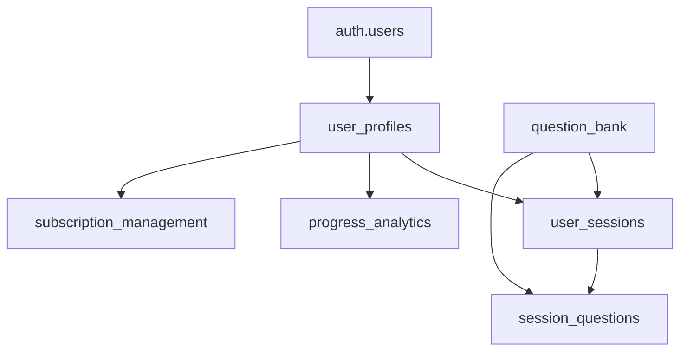

# Mellowise Database Migration Workflow

## Overview

This document defines the database migration workflow for Mellowise using Supabase CLI and PostgreSQL best practices. All schema changes must follow this workflow to ensure consistency across environments.

## Prerequisites

- Supabase CLI installed (`npm install -g supabase`)
- Supabase project configured and linked
- PostgreSQL knowledge for writing migrations

## Migration Workflow Process

### 1. Local Development Setup

```bash
# Initialize Supabase locally (first time only)
supabase init

# Start local Supabase instance
supabase start

# Link to remote project
supabase link --project-ref <project-id>
```

### 2. Creating New Migrations

```bash
# Generate new migration file
supabase migration new create_user_profiles_table

# Edit the generated SQL file in supabase/migrations/
# Example: 20240109123456_create_user_profiles_table.sql
```

### 3. Migration File Structure

```sql
-- Migration: create_user_profiles_table
-- Purpose: Create user profiles table with authentication integration

-- Create user profiles table
CREATE TABLE IF NOT EXISTS public.user_profiles (
  id UUID DEFAULT gen_random_uuid() PRIMARY KEY,
  user_id UUID REFERENCES auth.users(id) ON DELETE CASCADE,
  name TEXT NOT NULL,
  target_test_date DATE,
  current_score INTEGER CHECK (current_score >= 120 AND current_score <= 180),
  learning_preferences JSONB DEFAULT '{}',
  created_at TIMESTAMP WITH TIME ZONE DEFAULT NOW(),
  updated_at TIMESTAMP WITH TIME ZONE DEFAULT NOW()
);

-- Enable Row Level Security
ALTER TABLE public.user_profiles ENABLE ROW LEVEL SECURITY;

-- Create RLS policies
CREATE POLICY "Users can view own profile" ON public.user_profiles
  FOR SELECT USING (auth.uid() = user_id);

CREATE POLICY "Users can update own profile" ON public.user_profiles
  FOR UPDATE USING (auth.uid() = user_id);

-- Create indexes for performance
CREATE INDEX idx_user_profiles_user_id ON public.user_profiles(user_id);
CREATE INDEX idx_user_profiles_target_date ON public.user_profiles(target_test_date);

-- Create updated_at trigger
CREATE OR REPLACE FUNCTION trigger_set_timestamp()
RETURNS TRIGGER AS $$
BEGIN
  NEW.updated_at = NOW();
  RETURN NEW;
END;
$$ LANGUAGE plpgsql;

CREATE TRIGGER set_timestamp
  BEFORE UPDATE ON public.user_profiles
  FOR EACH ROW
  EXECUTE FUNCTION trigger_set_timestamp();
```

### 4. Testing Migrations Locally

```bash
# Apply migration to local database
supabase db push

# Reset database to test migrations from scratch
supabase db reset

# Verify migration applied successfully
supabase migration list
```

### 5. Deploying to Production

```bash
# Deploy to staging environment first
SUPABASE_ENV=staging supabase db push

# After validation, deploy to production
SUPABASE_ENV=production supabase db push
```

### 6. Schema Validation

```bash
# Pull current remote schema to validate
supabase db pull

# Generate diff to compare local vs remote
supabase db diff -f validation_check
```

## Core Schema Structure

### Required Tables (Story 1.1)

1. **User Profiles** - User account information and preferences
2. **Question Bank** - LSAT questions with categorization
3. **User Sessions** - Study session tracking
4. **Progress Analytics** - Performance metrics and trends  
5. **Subscription Management** - Payment and subscription data

### Schema Dependencies



## Migration Best Practices

### DO:
- ✅ Always include `IF NOT EXISTS` for table creation
- ✅ Use descriptive migration names with purpose
- ✅ Include proper indexes for query performance
- ✅ Enable RLS and create appropriate policies
- ✅ Test migrations on local environment first
- ✅ Include rollback procedures in comments

### DON'T:
- ❌ Never modify existing migration files
- ❌ Don't deploy to production without staging validation  
- ❌ Avoid breaking changes without versioning strategy
- ❌ Don't forget to update TypeScript types after schema changes

## Rollback Procedures

```bash
# Rollback to specific migration (local only)
supabase db reset --version 20240109123456

# For production rollbacks, create new migration to undo changes
supabase migration new rollback_user_profiles_changes
```

## Environment Configuration

### Development
- Local Supabase instance with full access
- Automated testing with fresh database resets

### Staging  
- Mirrors production configuration
- Used for migration validation before production deploy

### Production
- Managed Supabase instance with backups
- Read replicas for analytics queries
- Point-in-time recovery enabled

## Troubleshooting

### Common Issues

1. **Migration conflicts**: Use `supabase db pull` to sync with remote
2. **Permission errors**: Verify Supabase project permissions
3. **Schema drift**: Regular validation with `supabase db diff`

### Support Resources

- [Supabase CLI Documentation](https://supabase.com/docs/guides/cli)
- [PostgreSQL Migration Best Practices](https://wiki.postgresql.org/wiki/Don%27t_Do_This)
- Internal team Slack channel: #mellowise-database