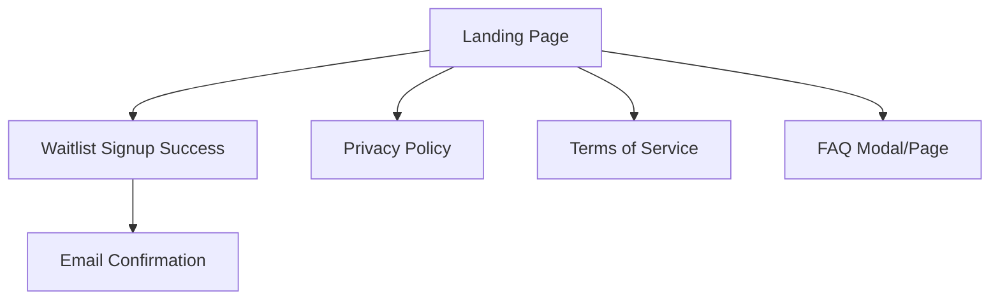
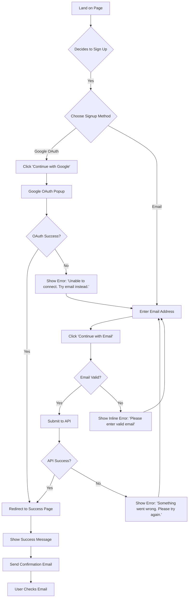
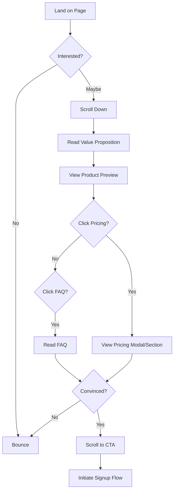

# Mellowise Landing Page UI/UX Specification

**Version:** 1.0
**Last Updated:** September 30, 2025
**Status:** Draft - Ready for Review

---

## Introduction

This document defines the user experience goals, information architecture, user flows, and visual design specifications for **Mellowise Landing Page & Waitlist**'s user interface. It serves as the foundation for visual design and frontend development, ensuring a cohesive and user-centered experience.

**Page Purpose:** Convert visitors into beta waitlist signups through an elegant, conversion-optimized landing page inspired by modern AI product launches (reference: Sana AI design pattern).

**Scope:** This specification covers the public-facing landing page only—not the authenticated Mellowise application. It focuses on first-touch conversion and brand introduction.

### Change Log

| Date | Version | Description | Author |
|------|---------|-------------|--------|
| 2025-09-30 | 1.0 | Initial landing page specification | Sally (UX Expert) |

---

## 1. Overall UX Goals & Principles

### 1.1 Target User Personas

1. **LSAT Aspiring Student**
   - Pre-law students seeking modern, effective test prep alternatives to traditional courses
   - Age: 21-25, tech-savvy, mobile-first
   - Pain point: Expensive prep courses ($1,500+), outdated teaching methods
   - Goal: Find affordable, engaging LSAT prep that fits busy schedule

2. **Busy Professional**
   - Career-changers with limited study time who need flexible, AI-powered learning
   - Age: 26-35, working full-time while studying
   - Pain point: Limited study time, need efficient learning
   - Goal: Maximize study effectiveness in minimal time

3. **Institution Decision-Maker**
   - University administrators evaluating platforms for student success programs
   - Role: Pre-law advisor, student success coordinator
   - Pain point: Need scalable, data-driven solutions for students
   - Goal: Improve law school admission rates, demonstrate ROI

### 1.2 Usability Goals

- **Immediate Clarity:** Visitors understand Mellowise's value proposition within 3 seconds of landing
- **Frictionless Signup:** Waitlist registration completed in under 15 seconds (2 clicks for OAuth)
- **Trust Building:** Design conveys professionalism, security, and educational credibility
- **Mobile-First:** 60%+ of traffic expected from mobile; mobile experience is primary
- **Conversion-Optimized:** Target 25%+ visitor-to-signup conversion rate

### 1.3 Design Principles

1. **Clarity Over Cleverness** - Every element serves conversion; no decorative distractions
2. **Elegant Simplicity** - Minimal UI with maximum impact; inspired by premium SaaS products
3. **Immediate Visual Proof** - Show the product in action through realistic dashboard preview
4. **Accessible by Default** - WCAG 2.1 AA compliance from day one
5. **Performance First** - Sub-2-second load time; instant interaction feedback

---

## 2. Information Architecture (IA)

### 2.1 Site Map / Screen Inventory



### 2.2 Navigation Structure

**Primary Navigation:**
- Logo (top-left, links to landing page)
- Top Nav: Overview | Pricing | Privacy and Terms | FAQ
- CTA Button: "Join Waitlist" (persistent in header)

**Secondary Navigation:**
- Footer links: Privacy Policy, Terms of Service, Contact
- Social proof indicators (optional): "Join 1,000+ students" counter

**Breadcrumb Strategy:**
- Not applicable (single-page landing)

---

## 3. User Flows

### 3.1 Flow: Waitlist Signup (Primary Conversion Flow)

**User Goal:** Sign up for beta access to Mellowise LSAT prep platform

**Entry Points:**
- Primary CTA: "Continue with Google" button
- Secondary CTA: Email input field
- Header CTA: "Join Waitlist" button

**Success Criteria:**
- User email captured in database
- User receives confirmation email
- User sees success state with next steps

#### Flow Diagram



#### Edge Cases & Error Handling

- **Email already registered:** Show friendly message "You're already on the list! Check your email for next steps."
- **Invalid email format:** Real-time validation with inline error message
- **OAuth popup blocked:** Detect popup blocker, show message to allow popups or use email
- **Network failure:** Show retry option with helpful error message
- **Slow API response:** Show loading state after 500ms to prevent perceived lag
- **Email delivery failure:** Log for follow-up; user still sees success (don't block conversion)

#### Notes

- **Loading States:** Show spinner in button during submission ("Joining waitlist...")
- **Success State:** Redirect to dedicated success page (not modal) for clear completion
- **Email Confirmation:** Send immediately; include "What's Next" section with timeline
- **Analytics:** Track conversion funnel: page_view → cta_click → signup_start → signup_complete

---

### 3.2 Flow: Browse Without Signup

**User Goal:** Learn about Mellowise without committing to signup

**Entry Points:**
- Top nav links (Overview, Pricing, FAQ)
- Scroll down page to read content
- View product preview (right panel mockup)

**Success Criteria:**
- User understands value proposition
- User knows pricing (transparent, builds trust)
- User's questions answered via FAQ
- Multiple conversion opportunities presented

#### Flow Diagram



#### Edge Cases & Error Handling

- **FAQ not comprehensive:** Provide "Contact Us" fallback link
- **Pricing concerns:** Address in FAQ with beta discount messaging
- **Mobile scrolling:** Sticky header with CTA always accessible

---

## 4. Wireframes & Mockups

### 4.1 Design Files

**Primary Design Reference:** Sana AI landing page (provided screenshot)

**Design Tool:** To be created in Figma (recommended) or iterate directly with v0.dev AI generation

**Key Inspiration:** Split-screen layout with clean form (left) and dark product preview (right)

### 4.2 Key Screen Layouts

#### Screen: Landing Page (Desktop)

**Purpose:** Convert visitors to waitlist signups with elegant, professional design

**Layout Structure:**
- **60/40 Split:** 60% left (form area), 40% right (product preview)
- **Fixed Height:** 100vh for above-the-fold impact
- **Responsive:** Stacks vertically on mobile (form on top)

**Key Elements:**

**Left Panel:**
1. **Header Navigation**
   - Logo (top-left, ~32px height)
   - Top nav links: Overview | Pricing | Privacy and Terms | FAQ
   - Horizontal layout, clean typography
   - Sticky on scroll

2. **Hero Section** (vertically centered)
   - **Headline:** "Welcome to Mellowise" (56px, bold, dark gray/black)
   - **Subheadline:** "Your AI assistant for LSAT mastery" (28px, light gray)
   - **Spacing:** 24px between headline and subheadline

3. **Signup Form**
   - **Google OAuth Button:**
     - White background, dark border
     - Google logo + "Continue with Google" text
     - 48px height, full width (max 400px)
     - Hover state: subtle shadow

   - **Divider:** "or" text with horizontal lines (16px spacing)

   - **Email Input:**
     - Placeholder: "your.email@example.com"
     - 48px height, rounded-lg border
     - Focus state: blue ring (ring-2 ring-primary)

   - **Email Submit Button:**
     - Black background, white text
     - "Continue with email" text
     - 48px height, full width
     - Hover state: slightly lighter black

4. **Legal Footer**
   - Small text (14px): "By signing up, you agree to the Terms of Use, Privacy Notice, and Cookie Notice"
   - Links styled as underlined
   - Muted gray color

**Right Panel:**
1. **Dark Background** (#1A1A1A or similar)
2. **Product Mockup**
   - Elegant laptop/desktop screenshot showing Mellowise dashboard
   - Features visible:
     - Personalized greeting ("Hello, [Name]")
     - Study module cards (colorful, engaging)
     - Progress indicators
     - AI-powered recommendations
   - Perspective/3D effect for visual interest
   - Subtle gradient overlay for polish

**Interaction Notes:**
- **Smooth scroll** for top nav links
- **Form validation** on blur (email field)
- **Loading states** for button submissions
- **Success animation** on signup completion

**Design File Reference:** To be created based on Sana AI pattern

---

#### Screen: Landing Page (Mobile)

**Purpose:** Optimize conversion for mobile-first users (60%+ of traffic)

**Layout Changes:**
- **Stacked Vertical:** Form section on top, product preview below (or removed on small screens)
- **Full Width:** Form elements use full viewport width (16px padding)
- **Sticky CTA:** "Join Waitlist" button sticky to bottom of viewport
- **Navigation:** Hamburger menu for top nav links

**Key Elements:**

1. **Mobile Header**
   - Logo (left), Hamburger menu (right)
   - Height: 64px
   - White background, bottom border

2. **Hero Section** (reduced spacing)
   - Headline: 36px (down from 56px)
   - Subheadline: 20px (down from 28px)
   - Padding: 24px horizontal, 32px vertical

3. **Signup Form** (same elements, adjusted sizing)
   - Buttons: 48px height (finger-friendly)
   - Input fields: Larger touch targets
   - Spacing: 16px between elements

4. **Product Preview** (optional)
   - Show simplified version or hide entirely on <375px
   - Use static image (not interactive) to reduce load

5. **Sticky Bottom CTA**
   - Fixed to bottom of screen
   - Black button: "Join Beta Waitlist"
   - Appears after user scrolls past hero section
   - 56px height, full width, slight shadow

**Interaction Notes:**
- **Touch-friendly:** All tap targets minimum 44x44px
- **Fast load:** Lazy load product preview image
- **Keyboard accessible:** Form fields work with mobile keyboards
- **Auto-focus:** Don't auto-focus email field (prevents unwanted keyboard popup)

---

#### Screen: Waitlist Success Page

**Purpose:** Confirm signup and set expectations for next steps

**Key Elements:**

1. **Success Confirmation**
   - ✅ Checkmark icon (large, green, animated)
   - Headline: "You're on the list!"
   - Subheadline: "Check your email for confirmation and next steps"

2. **What's Next Section**
   - "1. Check your inbox for welcome email"
   - "2. We'll notify you when beta access is ready"
   - "3. Expected timeline: 2-4 weeks"

3. **Social Sharing** (optional)
   - "Know someone studying for the LSAT? Share Mellowise"
   - Twitter, LinkedIn, Email share buttons

4. **Return to Site CTA**
   - "Learn More About Mellowise" button
   - Links back to landing page

**Design File Reference:** To be created

---

## 5. Component Library / Design System

### 5.1 Design System Approach

**Using:** shadcn/ui (existing Mellowise design system)

**Customization:** Minimal custom components; leverage shadcn/ui for consistency with main app

**Key Decision:** Landing page inherits design system from main Mellowise app to ensure visual continuity when users transition from waitlist → beta access.

### 5.2 Core Components

#### Component: Navbar (navbar-01)

**Purpose:** Primary navigation for landing page

**Source:** shadcn/ui navbar-01 component

**Variants:**
- Desktop: Horizontal links visible
- Mobile: Hamburger menu with slide-out drawer

**States:**
- Default: White background, subtle bottom border
- Sticky: Same styling when scrolled (no visual change)
- Mobile Menu Open: Overlay drawer from left/right

**Usage Guidelines:**
- Use shadcn/ui `Navbar01` component with custom props:
  ```tsx
  navigationLinks={[
    { href: '#overview', label: 'Overview', active: true },
    { href: '#pricing', label: 'Pricing' },
    { href: '#privacy', label: 'Privacy and terms' },
    { href: '#faq', label: 'FAQ' }
  ]}
  ```

**Customization:**
- Replace shadcn.io logo with Mellowise logo
- Update CTA text to "Join Waitlist"

---

#### Component: Input Button (input-button)

**Purpose:** Animated email input with submit button (optional advanced pattern)

**Source:** shadcn/ui input-button component

**Variants:**
- Collapsed: Button only ("Join Waitlist")
- Expanded: Input field + submit button

**States:**
- Idle: Button visible
- Active: Input field expands with animation
- Loading: Spinner in submit button
- Success: Checkmark + "Joined!" message

**Usage Guidelines:**
- **Alternative to static form:** Use for playful, modern interaction
- **Trade-off:** More complex than standard form; test conversion impact
- **Implementation:**
  ```tsx
  <InputButtonProvider>
    <InputButton>
      <InputButtonAction>Join Waitlist</InputButtonAction>
      <InputButtonInput placeholder="your.email@example.com" />
      <InputButtonSubmit>Continue</InputButtonSubmit>
    </InputButton>
  </InputButtonProvider>
  ```

**Recommendation:** Start with **standard form** (lower complexity), consider input-button for v2 if conversion data supports it.

---

#### Component: Button

**Purpose:** Primary and secondary CTAs throughout landing page

**Source:** shadcn/ui Button component

**Variants:**
- **Primary:** Black background (`bg-black`), white text, used for main CTAs
- **Secondary:** White background, black border, used for less important actions
- **OAuth:** White background, brand logos (Google icon), black text

**States:**
- Default: Solid color
- Hover: Slight opacity change (90%)
- Focus: Ring outline for keyboard navigation
- Loading: Spinner replaces text
- Disabled: Reduced opacity, no pointer events

**Usage Guidelines:**
- Primary CTA: "Continue with email", "Join Waitlist"
- Secondary CTA: "Learn More", "View Pricing"
- OAuth: "Continue with Google" (include Google SVG icon)

---

#### Component: Input

**Purpose:** Email input field for waitlist signup

**Source:** shadcn/ui Input component

**Variants:**
- Standard: Single-line text input
- Error state: Red border + error message below

**States:**
- Default: Gray border
- Focus: Blue ring (`ring-primary`)
- Error: Red border (`border-destructive`) + error message
- Disabled: Grayed out (not used in landing page)

**Usage Guidelines:**
- Always include `type="email"` for mobile keyboard optimization
- Add `placeholder="your.email@example.com"` for clarity
- Validate on blur (when user leaves field)
- Show inline error below field: "Please enter a valid email address"

---

## 6. Branding & Style Guide

### 6.1 Visual Identity

**Brand Guidelines:** Inherit from Mellowise main application

**Landing Page Specific:** Emphasize professionalism, trust, and modern AI product positioning

### 6.2 Color Palette

| Color Type | Hex Code | Usage |
|------------|----------|-------|
| **Primary** | #000000 (Black) | Primary CTAs, headlines, high-emphasis text |
| **Secondary** | #6366F1 (Indigo) | Accent color for links, interactive elements |
| **Accent** | #10B981 (Green) | Success states, positive feedback |
| **Success** | #10B981 | Waitlist confirmation, checkmarks |
| **Warning** | #F59E0B | Form validation warnings |
| **Error** | #EF4444 | Error messages, validation failures |
| **Neutral Gray** | #F9FAFB (Light), #6B7280 (Medium), #1F2937 (Dark) | Backgrounds, borders, secondary text |
| **Dark Panel** | #1A1A1A | Right panel background for product preview |

### 6.3 Typography

#### Font Families

- **Primary:** Inter (sans-serif) - Clean, professional, excellent readability
- **Secondary:** Inter (same family for consistency)
- **Monospace:** JetBrains Mono (for code snippets, if needed)

#### Type Scale

| Element | Size | Weight | Line Height | Usage |
|---------|------|--------|-------------|-------|
| **H1** | 56px (3.5rem) | 700 (Bold) | 1.1 | Main headline: "Welcome to Mellowise" |
| **H2** | 36px (2.25rem) | 600 (Semibold) | 1.2 | Section headings (mobile hero) |
| **H3** | 28px (1.75rem) | 600 (Semibold) | 1.3 | Subheadlines |
| **Body Large** | 18px (1.125rem) | 400 (Regular) | 1.6 | Subheadline text |
| **Body** | 16px (1rem) | 400 (Regular) | 1.5 | Form labels, general text |
| **Small** | 14px (0.875rem) | 400 (Regular) | 1.4 | Legal text, captions |

**Responsive Adjustments:**
- Mobile: Scale down H1 to 36px, H2 to 28px
- Maintain readability with minimum 16px body text on mobile

### 6.4 Iconography

**Icon Library:** Lucide React (included with shadcn/ui)

**Usage Guidelines:**
- **Google Logo:** Use official Google brand assets for OAuth button
- **Checkmark:** Success confirmations (green, 48px)
- **Arrow Right:** Submit button icons (16px)
- **Menu/Hamburger:** Mobile navigation (24px)

**Style:** Outline style, 2px stroke width, matching Lucide defaults

### 6.5 Spacing & Layout

**Grid System:** 12-column grid (Tailwind CSS default)

**Spacing Scale:**
- **4px (0.25rem):** Minimal gaps (icon + text)
- **8px (0.5rem):** Tight spacing
- **16px (1rem):** Standard element spacing
- **24px (1.5rem):** Section spacing
- **32px (2rem):** Large section gaps
- **64px (4rem):** Major section dividers

**Container Max Width:**
- Desktop: 1440px (max-w-screen-2xl)
- Form area: 400px max width for readability
- Mobile: Full width with 16px padding

---

## 7. Accessibility Requirements

### 7.1 Compliance Target

**Standard:** WCAG 2.1 Level AA

**Rationale:** Educational platforms must be accessible; many institutions require WCAG AA for procurement.

### 7.2 Key Requirements

#### Visual

- **Color contrast ratios:**
  - Text: Minimum 4.5:1 for normal text, 3:1 for large text (18px+)
  - Interactive elements: 3:1 for buttons, links
  - Tested with: Black (#000) on white (#FFF) = 21:1 ✅

- **Focus indicators:**
  - Visible focus ring (2px blue outline) on all interactive elements
  - Never remove `:focus` styles
  - Keyboard navigation must be clear

- **Text sizing:**
  - Minimum 16px body text
  - Users can zoom to 200% without breaking layout
  - No fixed pixel heights that prevent text reflow

#### Interaction

- **Keyboard navigation:**
  - All functionality accessible via keyboard (Tab, Enter, Escape)
  - Logical tab order: Logo → Nav Links → Email Input → Submit Button
  - Skip links for screen readers (optional for single-page layout)

- **Screen reader support:**
  - Semantic HTML: `<header>`, `<main>`, `<form>`, `<button>`
  - ARIA labels where needed: `aria-label="Sign up for waitlist"`
  - Form errors announced: `aria-live="polite"` for validation messages

- **Touch targets:**
  - Minimum 44x44px for all tap targets (mobile)
  - Spacing between targets to prevent mis-taps

#### Content

- **Alternative text:**
  - Product preview image: `alt="Mellowise AI-powered LSAT dashboard showing personalized study modules"`
  - Logo: `alt="Mellowise"` (text in image)

- **Heading structure:**
  - One `<h1>` per page: "Welcome to Mellowise"
  - Logical hierarchy: h1 → h2 → h3 (no skipping levels)

- **Form labels:**
  - Visible labels or clear placeholder + aria-label
  - Email input: `<label for="email">Email address</label>`
  - Error messages associated with fields via `aria-describedby`

### 7.3 Testing Strategy

**Automated Testing:**
- Lighthouse accessibility audit (target score: 95+)
- axe DevTools for WCAG violations
- WAVE browser extension

**Manual Testing:**
- Keyboard-only navigation test
- Screen reader test (VoiceOver on macOS, NVDA on Windows)
- Color blindness simulation (check form errors visible without color alone)

**Continuous Monitoring:**
- Add accessibility checks to CI/CD pipeline
- Playwright tests for keyboard navigation and screen reader compatibility

---

## 8. Responsiveness Strategy

### 8.1 Breakpoints

| Breakpoint | Min Width | Max Width | Target Devices | Layout Changes |
|------------|-----------|-----------|----------------|----------------|
| **Mobile** | 320px | 767px | iPhone SE, standard phones | Stacked vertical, full-width form, hide/simplify product preview |
| **Tablet** | 768px | 1023px | iPad, tablets | Stacked vertical or side-by-side with reduced image |
| **Desktop** | 1024px | 1439px | Laptops, small monitors | 60/40 split-screen layout |
| **Wide** | 1440px | - | Large monitors, 4K displays | 60/40 split with max container width (1440px) |

### 8.2 Adaptation Patterns

**Layout Changes:**
- **Mobile (< 768px):** Stack form on top, product preview below or hidden
- **Tablet (768-1023px):** Stack vertically with full-width form, smaller product image
- **Desktop (1024px+):** Side-by-side split-screen (60/40 ratio)

**Navigation Changes:**
- **Mobile:** Hamburger menu with slide-out drawer
- **Desktop:** Horizontal nav links in header

**Content Priority:**
- **Mobile:** Hero headline → Email signup → (optional) Product preview
- **Desktop:** Equal emphasis on form and visual proof

**Interaction Changes:**
- **Mobile:** Sticky bottom CTA appears after scroll
- **Desktop:** No sticky CTA needed (form always visible)

---

## 9. Animation & Micro-interactions

### 9.1 Motion Principles

**Purposeful Animation:** Every animation serves a functional purpose (feedback, guidance, delight)

**Performance First:** All animations GPU-accelerated (transform, opacity only)

**Respect Preferences:** Honor `prefers-reduced-motion` media query for accessibility

**Timing:** Fast interactions (200-300ms), slow transitions (400-500ms)

### 9.2 Key Animations

- **Page Load:** Fade in hero section (300ms, ease-out) - subtle entrance
- **Form Focus:** Input field border color transition (150ms, ease-in-out)
- **Button Hover:** Scale up 1.02x (200ms, ease-out) - playful feedback
- **Button Loading:** Spinner rotation (500ms, linear, infinite)
- **Success Checkmark:** Scale in + fade in (400ms, spring easing) - celebratory
- **Error Message:** Slide down + fade in (250ms, ease-out) - gentle alert
- **Mobile Menu:** Slide in from right (300ms, ease-out)
- **Sticky CTA:** Slide up from bottom (250ms, ease-out) when user scrolls past hero

**Implementation:** Use Framer Motion (already in shadcn/ui dependencies) for complex animations

---

## 10. Performance Considerations

### 10.1 Performance Goals

- **Page Load:** < 2 seconds (LCP - Largest Contentful Paint)
- **Interaction Response:** < 100ms (INP - Interaction to Next Paint)
- **Animation FPS:** 60fps (16.67ms per frame)

**Rationale:** Google Core Web Vitals impact SEO; fast pages convert better (every 100ms delay = 1% conversion drop)

### 10.2 Design Strategies

**Image Optimization:**
- Product preview: WebP format, lazy load, max 1200px width
- Logo: SVG (vector, infinitely scalable, tiny file size)
- Compress images to < 100KB each

**Code Splitting:**
- FAQ modal: Load on demand (don't include in initial bundle)
- Google OAuth SDK: Load asynchronously

**Critical CSS:**
- Inline above-the-fold CSS in `<head>`
- Defer non-critical styles

**Font Loading:**
- Use `font-display: swap` to prevent invisible text
- Subset Inter font to include only Latin characters (reduce file size)

**Third-Party Scripts:**
- Google Analytics: Load asynchronously, low priority
- Minimize external dependencies on landing page

**Playwright Performance Testing:**
- Set up Playwright tests to measure page load times
- Fail CI build if LCP > 2.5s

---

## 11. Next Steps

### 11.1 Immediate Actions

1. **Review and Approve Specification** - Stakeholder sign-off on design direction
2. **Gather Mellowise Brand Assets** - Logo (SVG), existing color palette, fonts
3. **Create Figma Mockups** - High-fidelity designs based on this spec (optional, can skip for v0.dev)
4. **Generate AI UI Prompt** - Create v0.dev prompt to scaffold React components
5. **Set Up Landing Page Route** - Create `/landing` or `/waitlist` route in Next.js
6. **Implement Backend Waitlist API** - POST `/api/waitlist` endpoint for email collection

### 11.2 Design Handoff Checklist

- [x] All user flows documented (Waitlist signup, Browse without signup)
- [x] Component inventory complete (Navbar, Button, Input, shadcn/ui components)
- [x] Accessibility requirements defined (WCAG 2.1 AA)
- [x] Responsive strategy clear (Mobile-first, 4 breakpoints)
- [x] Brand guidelines incorporated (Colors, typography, Mellowise identity)
- [x] Performance goals established (< 2s load, 60fps animations)

---

## 12. Technical Implementation Notes

### 12.1 shadcn/ui Components to Use

**Confirmed Components:**
- `navbar-01` - Top navigation with mobile hamburger menu
- `button` - All CTA buttons (primary, secondary, OAuth)
- `input` - Email input field
- `input-button` (optional) - Animated input for advanced interaction
- `form` - Form validation wrapper (React Hook Form integration)
- `toast` - Success/error notifications (optional alternative to inline messages)

### 12.2 Playwright Testing Strategy

**Critical User Flows to Test:**

1. **Waitlist Signup - Google OAuth**
   ```typescript
   test('User can sign up via Google OAuth', async ({ page }) => {
     await page.goto('/landing');
     await page.click('text=Continue with Google');
     // Mock OAuth flow
     await expect(page).toHaveURL('/waitlist/success');
   });
   ```

2. **Waitlist Signup - Email**
   ```typescript
   test('User can sign up via email', async ({ page }) => {
     await page.goto('/landing');
     await page.fill('input[type="email"]', 'test@example.com');
     await page.click('text=Continue with email');
     await expect(page).toHaveURL('/waitlist/success');
   });
   ```

3. **Form Validation**
   ```typescript
   test('Shows error for invalid email', async ({ page }) => {
     await page.goto('/landing');
     await page.fill('input[type="email"]', 'invalid-email');
     await page.click('text=Continue with email');
     await expect(page.locator('text=valid email')).toBeVisible();
   });
   ```

4. **Mobile Navigation**
   ```typescript
   test('Mobile menu works correctly', async ({ page }) => {
     await page.setViewportSize({ width: 375, height: 667 });
     await page.goto('/landing');
     await page.click('[aria-label="Open menu"]');
     await expect(page.locator('text=Pricing')).toBeVisible();
   });
   ```

5. **Performance Test**
   ```typescript
   test('Page loads in under 2 seconds', async ({ page }) => {
     const start = Date.now();
     await page.goto('/landing');
     const duration = Date.now() - start;
     expect(duration).toBeLessThan(2000);
   });
   ```

### 12.3 Context7 Integration

**Use Context7 for shadcn/ui Documentation:**

When implementing components, reference latest shadcn/ui documentation via Context7:

```typescript
// Example: Get latest Button component docs
import { mcp__context7__resolve-library-id } from 'context7';
// Query: "shadcn/ui button component usage"
```

**Benefits:**
- Always use latest component APIs
- Avoid deprecated patterns
- Access code examples and best practices

---

## 🎯 CRITICAL AREAS FOR REVIEW

Based on our time-optimization strategy, please review these 3 sections:

### 🔴 **Critical Area 1: User Flow (Section 3.1) - Waitlist Signup**

**Question:** Does the signup flow feel frictionless enough? Any conversion killers?

**Specific Concerns:**
- Is Google OAuth as primary option the right choice?
- Should we ask for name during signup or just email?
- Success page vs. modal - which converts better?

---

### 🔴 **Critical Area 2: Component Library (Section 5.2) - Tech Decisions**

**Question:** Should we use standard form or animated `input-button` component?

**Trade-offs:**
- **Standard form:** Simpler, faster to build, proven pattern
- **input-button:** More engaging, modern, but higher complexity

**Recommendation:** Start with standard form, A/B test input-button in v2

---

### 🔴 **Critical Area 3: Performance Strategy (Section 10)**

**Question:** Are < 2s load time goals realistic with product preview image?

**Optimization Plan:**
- Use Next.js Image component with WebP
- Lazy load product preview (loads after form visible)
- Consider static screenshot vs. animated demo

---

**Specification complete! Ready for:**
1. ✅ Architect review (technical feasibility)
2. ✅ Marketing review (messaging, copy)
3. ✅ Dev team implementation planning

**Next Step:** Should I transform into the **Architect** to validate technical implementation, or **Marketing Specialist** to draft copy?
