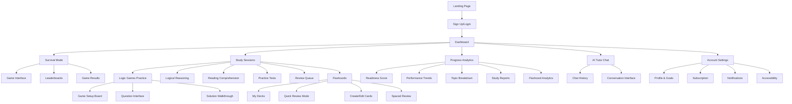
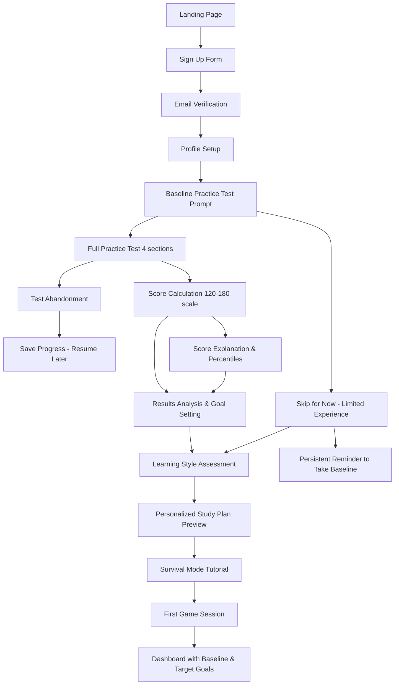
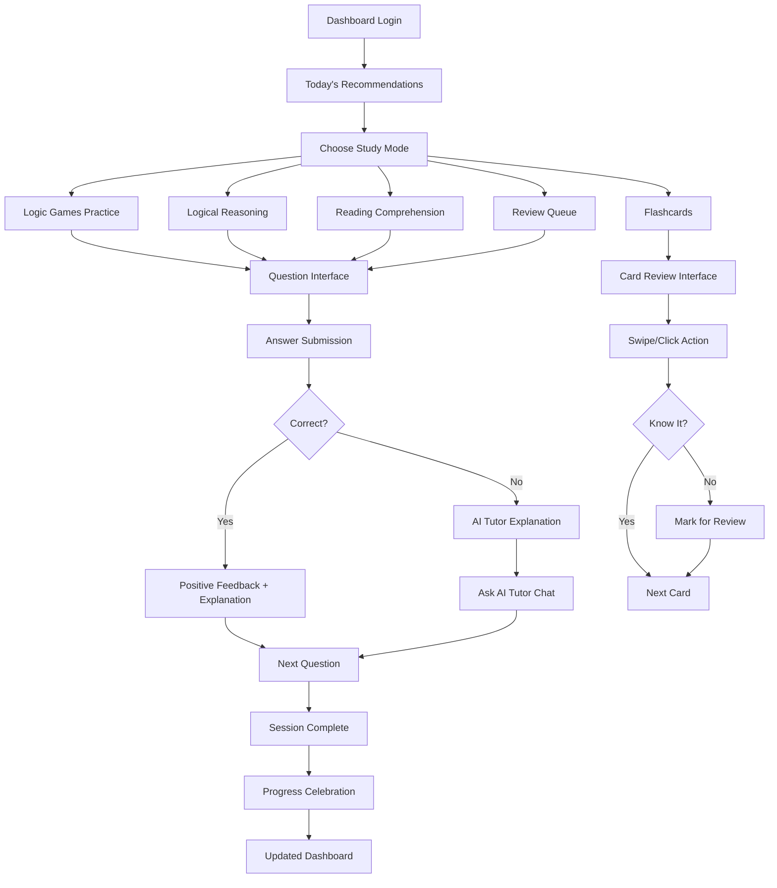
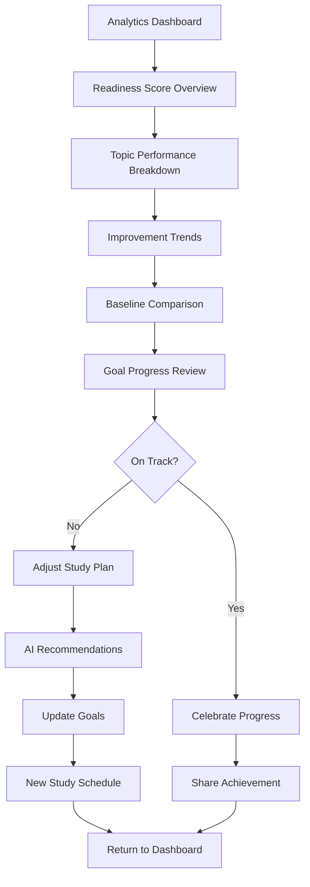

# Mellowise UI/UX Specification

## Introduction

This document defines the user experience goals, information architecture, user flows, and visual design specifications for Mellowise's user interface. It serves as the foundation for visual design and frontend development, ensuring a cohesive and user-centered experience that transforms test anxiety into confidence through thoughtful design.

### Overall UX Goals & Principles

#### Target User Personas

**Primary User: The Anxious Achiever (78% of market)**
- Age 22-26, pursuing law school or professional advancement
- High test anxiety despite strong academic background  
- Values personalized learning and emotional support
- Desktop-first for serious study, mobile for quick reviews
- Willing to pay for proven results and confidence building

**Secondary User: The Efficiency Seeker (22% of market)**
- Working professionals balancing career and test prep
- Time-constrained, values focused study recommendations
- Data-driven approach to progress tracking
- Premium pricing tolerance for comprehensive features

#### Usability Goals

**Anxiety Reduction**: Interface feels supportive, not intimidating - warm colors, encouraging messaging, gentle error handling
**Desktop Mastery**: Optimized for focused study sessions - generous whitespace, clear visual hierarchy, comfortable reading distances
**Instant Gratification**: Immediate feedback on all actions - progress animations, celebration moments, real-time scoring
**Effortless Flow**: Minimal cognitive load for navigation - clear information hierarchy, contextual help, predictable patterns
**Confidence Building**: Visual progress tracking builds motivation - readiness scores, improvement trends, achievement badges
**Mobile Convenience**: Seamless experience for on-the-go practice and progress checking between desktop study sessions

#### Design Principles

1. **Empathy Over Efficiency** - Prioritize emotional support and confidence building over speed optimization
2. **Desktop-First Design** - Design for focused laptop/desktop study sessions first, then optimize for mobile convenience
3. **Progress Made Visible** - Every interaction should show advancement toward LSAT readiness
4. **Gentle Gamification** - Game elements feel natural and encouraging, never childish or trivial
5. **Accessible by Design** - WCAG AA compliance built in from the start, not retrofitted

### Change Log

| Date | Version | Description | Author |
|------|---------|-------------|--------|
| 2025-01-09 | 1.0 | Initial UI/UX specification creation | UX Expert |

## Information Architecture (IA)

### Site Map / Screen Inventory

### Navigation Structure

**Primary Navigation:** Fixed top navigation bar with five core areas:
- Dashboard (home icon) - Central progress hub
- Study (book icon) - All practice modes and content
- Analytics (chart icon) - Performance tracking and reports  
- Tutor (chat icon) - AI conversation interface
- Account (user icon) - Settings and subscription management

**Secondary Navigation:** Context-sensitive left sidebar that adapts per section:
- Study section: Logic Games, Logical Reasoning, Reading Comp, Practice Tests, Review, Flashcards
- Analytics section: Readiness, Trends, Topics, Reports, Flashcard Analytics
- Account section: Profile, Subscription, Settings, Help

**Breadcrumb Strategy:** Contextual breadcrumbs for deep navigation within study content:
- Study > Logic Games > Sequencing Games > Question 47
- Analytics > Performance Trends > Last 30 Days > Logic Games Detail

**Quick Access:** Flashcard review available as floating action button on mobile for instant access to quick review sessions

## User Flows

### Flow 1: First-Time User Onboarding (with Baseline)

**User Goal:** Establish baseline LSAT score and create personalized learning profile

**Entry Points:** Landing page, referral links, search results

**Success Criteria:** Completes baseline practice test, understands current level, plays Survival Mode, sees improvement potential

### Practice Test Simulation Requirements

**Authentic Timing Structure:**
- **4 Sections:** 35 minutes each (140 minutes total study time)
- **Break Periods:** 10-minute break after Section 2, 1-minute between other sections
- **Interface Warnings:** 5-minute and 1-minute countdown alerts per section
- **Total Test Time:** ~3 hours including breaks and instructions
- **No Pausing:** Once started, sections must be completed within time limit

**Edge Cases & Error Handling:**
- Email verification failure → Resend option with clear troubleshooting
- Test abandonment → Save as incomplete with partial scoring
- Poor baseline performance → Encouraging messaging, foundational content recommendations
- Network interruption → Auto-save state, seamless resumption

**Notes:** Baseline test is crucial for credible progress tracking and improvement claims

### Flow 2: Daily Study Session (Premium User)

**User Goal:** Complete productive study session with AI-guided personalization

**Entry Points:** Dashboard recommendations, calendar reminders, direct navigation

**Success Criteria:** Completes recommended questions, receives AI feedback, sees progress toward goals

**Edge Cases & Error Handling:**
- Session interruption → Auto-save progress, resume from last question
- Consecutive wrong answers → Difficulty adjustment, confidence-building intervention
- Extended session → Fatigue detection, break recommendations
- AI service outage → Fallback to pre-generated explanations

### Flow 3: Progress Review & Goal Adjustment

**User Goal:** Understand LSAT readiness and adjust study strategy based on data

**Entry Points:** Weekly progress notification, dashboard analytics tile, pre-test anxiety

**Success Criteria:** Reviews performance trends, updates goals, feels confident about progress

**Edge Cases & Error Handling:**
- No improvement detected → Motivational messaging, strategy suggestions
- Goal date too aggressive → Realistic timeline recommendations
- Perfectionist anxiety → Focus on progress over absolute scores
- Data visualization confusion → Tooltips, guided explanations

## Wireframes & Mockups

### Design Files

**Primary Design Files:** To be created in Figma - [Mellowise Design System & Screen Library]

### Key Screen Layouts

#### Dashboard (Desktop Primary View)

**Purpose:** Central hub showing progress, recommendations, and quick access to all features

**Key Elements:**
- Header Navigation with Mellowise logo and main navigation tabs
- Progress Hero Section with large readiness score circle, days until test, current streak
- Today's Recommendations Card with AI-generated study suggestions
- Quick Stats Grid showing questions answered, improvement trend, milestones
- Recent Activity Feed with last sessions, achievements, AI conversations
- Call-to-Action Buttons for starting study sessions

**Interaction Notes:** Dashboard widgets are clickable to drill into detailed analytics, recommendations lead directly to suggested study content, progress animations on page load

**Design File Reference:** [Dashboard_Desktop_v1.fig]

#### Survival Mode Game Interface

**Purpose:** Engaging, game-like practice experience that serves as freemium hook

**Key Elements:**
- Game HUD with lives, score, time, difficulty indicator
- Clean question presentation with LSAT formatting
- Touch-friendly answer buttons with hover states
- Progress indicator showing question number
- Power-up inventory with usage counts
- Celebration animations for correct answers

**Interaction Notes:** Swipe gestures for mobile answer selection, keyboard shortcuts for desktop power users, immediate feedback animations

**Design File Reference:** [SurvivalMode_Interface_v1.fig]

#### Study Session Interface (Desktop Focus)

**Purpose:** Distraction-free environment for serious LSAT preparation with integrated AI help

**Key Elements:**
- Question Panel (60% width) with full LSAT question and diagram space
- AI Tutor Sidebar (25% width) with collapsible chat interface
- Session Controls (15% width) with timer and navigation
- Answer Interface with submit button and confidence rating
- Expandable Explanation Panel with visual aids
- Progress Tracker showing session completion

**Interaction Notes:** AI tutor appears contextually based on struggle indicators, explanations reveal progressively, session state saving

**Design File Reference:** [StudySession_Desktop_v1.fig]

#### Analytics Dashboard

**Purpose:** Comprehensive performance tracking that builds confidence through visible progress

**Key Elements:**
- Readiness Score Gauge with confidence interval
- Performance Trend Chart with baseline marker
- Topic Mastery Heatmap showing strengths/weaknesses
- Study Time Analytics with consistency tracking
- Goal Progress visualization with milestones
- Comparative Metrics with optional peer comparison

**Interaction Notes:** All charts are interactive with drill-down capability, time range selectors, exportable reports

**Design File Reference:** [Analytics_Dashboard_v1.fig]

## Component Library / Design System

### Design System Approach

**Design System Approach:** Custom component library built on React/Next.js foundation with Tailwind CSS utility classes, inspired by Material Design principles but with warmer, education-focused personality. Components prioritize accessibility, responsiveness, and emotional engagement over stark minimalism.

### Core Components

#### Progress Indicator Component

**Purpose:** Visualize user progress across multiple contexts

**Variants:** Circular gauge, Linear bar, Stepped progress, Animated celebration state

**States:** Empty, In Progress, Complete, Celebration, Error/Warning

**Usage Guidelines:** Use circular for major metrics, linear for session progress, stepped for multi-part workflows. Always include percentage for accessibility. Celebration animations at 25%, 50%, 75%, 100% milestones.

#### Question Card Component

**Purpose:** Consistent presentation of LSAT questions across all study modes

**Variants:** Standard, Compact, Game Mode, Practice Test

**States:** Unanswered, Answered Correct, Answered Incorrect, Flagged, Under Review, Time Warning

**Usage Guidelines:** Maintain consistent padding and typography. Preserve LSAT formatting conventions. Include timer display for timed modes. Ensure 44x44px minimum touch targets.

#### Button Component

**Purpose:** Primary interaction element for all user actions

**Variants:** Primary, Secondary, Success, Danger, Ghost, Game

**States:** Default, Hover, Active, Disabled, Loading, Success Animation

**Usage Guidelines:** Primary buttons limited to 1-2 per screen. Success buttons for answer submission. Loading states required for async actions. Game buttons include visual affordance for remaining uses.

#### AI Chat Component

**Purpose:** Consistent AI tutor interaction across desktop sidebar and mobile modal

**Variants:** Sidebar, Modal, Inline, Minimized

**States:** Idle, Typing, Loading Response, Error, Minimized

**Usage Guidelines:** Always show typing indicator during AI processing. Limit response length for readability. Include "Ask follow-up" prompt. Error states provide fallback content.

#### Achievement Badge Component

**Purpose:** Gamification element celebrating user milestones and progress

**Variants:** Bronze/Silver/Gold/Diamond, Special, Locked, New

**States:** Locked, Earned, New (animation), Featured

**Usage Guidelines:** Badges appear in profile, dashboard, and as toast notifications. New badge animations are non-blocking. Include descriptive text for screen readers.

#### Flashcard Component

**Purpose:** Interactive study cards for concept memorization and quick review sessions

**Variants:** Standard, Rich Media, Multi-sided, Compact, Mini

**States:** Face Up, Flipping, Face Down, Flagged, Mastered, Due for Review

**Usage Guidelines:** Swipe right for "knew it", left for "needs review". Tap to flip on mobile, spacebar on desktop. Minimum card height 200px. Include progress indicator. Auto-advance option available.

#### Deck Manager Component

**Purpose:** Organize and manage flashcard collections by topic or custom groupings

**Variants:** Grid View, List View, Creation Mode, Selection Mode

**States:** Active, Scheduled, Completed, Empty

**Usage Guidelines:** Display card count and due count prominently. Show last reviewed date and average performance. One-tap access to quick review. Include "Smart Deck" auto-generation option.

#### Data Visualization Component

**Purpose:** Present analytics and progress data in digestible formats

**Variants:** Line Chart, Bar Chart, Heatmap, Gauge, Sparkline

**States:** Loading, Active, Interactive, Empty State

**Usage Guidelines:** All charts must be keyboard navigable and screen reader accessible. Include clear legends and axis labels. Interactive elements show tooltips on hover/focus.

## Branding & Style Guide

### Visual Identity

**Brand Guidelines:** Mellowise Visual Identity Guide v1.0 - Balancing academic credibility with approachable warmth

### Color Palette

| Color Type | Hex Code | Usage |
|------------|----------|--------|
| Primary | #4F46E5 | Main brand color - confidence-inspiring indigo for CTAs, navigation, progress indicators |
| Secondary | #10B981 | Success green - correct answers, achievements, positive progress |
| Accent | #F59E0B | Attention amber - power-ups, streaks, important notifications |
| Success | #059669 | Deeper success - completion states, milestone achievements |
| Warning | #EF4444 | Gentle red - wrong answers (softened to reduce anxiety) |
| Error | #DC2626 | System errors, critical alerts (used sparingly) |
| Neutral | #F9FAFB, #E5E7EB, #6B7280, #1F2937 | Backgrounds, borders, text hierarchy |

### Typography

#### Font Families
- **Primary:** Inter - Clean, highly readable sans-serif for UI and body text
- **Secondary:** Libre Baskerville - Serif for reading comprehension passages (mimics LSAT format)
- **Monospace:** JetBrains Mono - Code examples, timer displays, score numbers

#### Type Scale

| Element | Size | Weight | Line Height |
|---------|------|--------|-------------|
| H1 | 36px | 700 | 1.2 |
| H2 | 28px | 600 | 1.3 |
| H3 | 22px | 600 | 1.4 |
| Body | 16px | 400 | 1.6 |
| Small | 14px | 400 | 1.5 |

### Iconography

**Icon Library:** Heroicons with custom education-specific additions

**Usage Guidelines:** Outline style for navigation and buttons. Solid style for active states. 24px default size. Custom icons for Logic Games, Survival Mode, AI Tutor.

### Spacing & Layout

**Grid System:** 12-column grid with 24px gutters on desktop, 4-column grid with 16px gutters on mobile

**Spacing Scale:** Base unit: 4px. Scale: 4, 8, 12, 16, 24, 32, 48, 64, 96px. Consistent padding: 16px mobile, 24px tablet, 32px desktop.

## Accessibility Requirements

### Compliance Target

**Standard:** WCAG 2.1 Level AA Compliance with select AAA enhancements for critical learning features

### Key Requirements

**Visual:**
- Color contrast ratios: Minimum 4.5:1 for normal text, 3:1 for large text, 7:1 for critical study content
- Focus indicators: High-contrast 3px outline on all interactive elements
- Text sizing: Base 16px minimum, user-adjustable up to 200% without horizontal scrolling

**Interaction:**
- Keyboard navigation: Full keyboard access to all features, logical tab order, skip links
- Screen reader support: Semantic HTML, ARIA labels, live regions for real-time updates
- Touch targets: Minimum 44x44px on mobile, 24x24px on desktop with adequate spacing

**Content:**
- Alternative text: Descriptive alt text for all images, extended descriptions for Logic Games diagrams
- Heading structure: Logical h1-h6 hierarchy, one h1 per page
- Form labels: Clear, descriptive labels, error messages linked to fields

**Mellowise-Specific Accessibility Features:**
- Timer Accommodations: Extended time options (1.5x, 2x)
- Cognitive Load Reduction: Simplified view mode
- Reading Assistance: Dyslexia-friendly font option
- Audio Support: Text-to-speech for questions
- Progress Persistence: Auto-save every interaction
- High Contrast Modes: Pure black/white option

### Testing Strategy

**Automated Testing:**
- axe DevTools integration in CI/CD pipeline
- Lighthouse accessibility audits
- Pa11y command-line testing
- Automated lawsuit risk scanning

**Manual Testing Protocol:**
- Keyboard-only navigation testing
- Screen reader testing (NVDA, VoiceOver)
- Survival Mode dual-track testing (visual + audio)
- Cognitive load assessment with ADHD users
- Third-party component audits

**User Testing:**
- Include users with disabilities in beta
- Partner with disability advocacy groups
- Quarterly professional accessibility audits
- Pre-launch legal review
- Monthly accessibility office hours

**Risk Mitigation Implementation:**
- Accessibility-first sprint planning (20% allocation)
- Parallel experience development for complex interactions
- $25,000 remediation fund for rapid fixes
- Accessibility documentation portal
- Monthly developer training

## Responsiveness Strategy

### Breakpoints

| Breakpoint | Min Width | Max Width | Target Devices |
|------------|-----------|-----------|----------------|
| Mobile | 320px | 767px | Phones - quick reviews, flashcards, progress checking |
| Tablet | 768px | 1023px | iPads - reading sessions, medium-complexity practice |
| Desktop | 1024px | 1439px | Laptops - primary study sessions, Logic Games |
| Wide | 1440px | - | Large monitors - power users, split-screen studying |

### Adaptation Patterns

**Layout Changes:** Desktop three-column, tablet two-column, mobile single column with bottom navigation

**Navigation Changes:** Desktop fixed top nav + sidebar, tablet hamburger menu, mobile bottom tab bar

**Content Priority:** Desktop full density, tablet hide secondary actions, mobile focus on current task

**Interaction Changes:** Desktop hover states and shortcuts, tablet touch-optimized, mobile swipe gestures

**Feature-Specific Adaptations:**
- Survival Mode: Desktop full interface, mobile fullscreen game
- Logic Games: Desktop split view, mobile simplified tools
- Practice Tests: Desktop/tablet only, mobile shows warning
- Flashcards: Desktop grid view, mobile stack view

## Animation & Micro-interactions

### Motion Principles

**Mellowise Motion Philosophy:** Animations should feel encouraging and purposeful, never distracting from study focus. Every motion reinforces progress and achievement while respecting users' cognitive load and potential motion sensitivities.

**Core Principles:**
1. Purpose Over Polish - Every animation has functional purpose
2. Gentle Encouragement - Celebratory animations are warm, not overwhelming
3. Respect for Focus - Study animations subtle, achievements prominent
4. Performance First - No animation causes jank or delay
5. Accessibility Always - Respect prefers-reduced-motion settings

### Key Animations

- **Progress Bar Fill:** Smooth ease-out filling (Duration: 600ms, Easing: cubic-bezier(0.4, 0, 0.2, 1))
- **Correct Answer Celebration:** Gentle pulse + checkmark (Duration: 400ms, Easing: ease-out)
- **Wrong Answer Feedback:** Subtle shake + hint slide-in (Duration: 300ms, Easing: ease-in-out)
- **Streak Counter Increment:** Number roll-up with glow (Duration: 500ms, Easing: spring)
- **Achievement Badge Unlock:** Scale-up + shimmer + confetti (Duration: 800ms, Easing: back-out)
- **Flashcard Flip:** 3D rotation with depth (Duration: 300ms, Easing: ease-in-out)
- **AI Tutor Typing:** Dots animation (Duration: 1000ms loop, Easing: linear)
- **Level Up Notification:** Slide-in + fireworks (Duration: 1000ms, Easing: ease-out)

## Performance Considerations

### Performance Goals

- **Page Load:** Initial load under 2 seconds on 3G, under 1 second on broadband
- **Interaction Response:** User input acknowledgment within 100ms, action completion within 300ms
- **Animation FPS:** Consistent 60fps for all animations, graceful degradation on low-end devices

### Design Strategies

**Performance Optimization Strategies:**

1. **Progressive Enhancement** - Core functionality first, enhancements async, offline-first for critical features

2. **Asset Optimization** - SVG icons, WebP images, lazy loading, critical CSS inlined

3. **Interaction Optimization** - Optimistic UI updates, skeleton screens, virtual scrolling, debounced inputs

4. **AI Response Management** - Pre-cached explanations, streaming responses, fallback content, queue management

5. **Mobile-Specific Optimizations** - Reduced animations, passive listeners, smaller bundles, service worker

**Performance Budget:**
- JavaScript: <200KB gzipped
- CSS: <50KB gzipped  
- Images: <500KB per page
- Time to Interactive: <3.5s on 3G
- First Contentful Paint: <1.5s on 3G

## Next Steps

### Immediate Actions

1. Create high-fidelity mockups in Figma based on component specifications
2. Develop interactive prototype for user testing of key flows
3. Conduct accessibility audit of prototype with screen reader users
4. Create detailed design handoff documentation with measurements and states
5. Build component library in Storybook for developer reference

### Design Handoff Checklist

✓ All user flows documented  
✓ Component inventory complete  
✓ Accessibility requirements defined  
✓ Responsive strategy clear  
✓ Brand guidelines incorporated  
✓ Performance goals established  
✓ Animation specifications provided  
✓ Design tokens exported for development

## Checklist Results

The UI/UX specification is comprehensive and ready for implementation. All critical design decisions have been documented with clear rationale and validation needs identified.